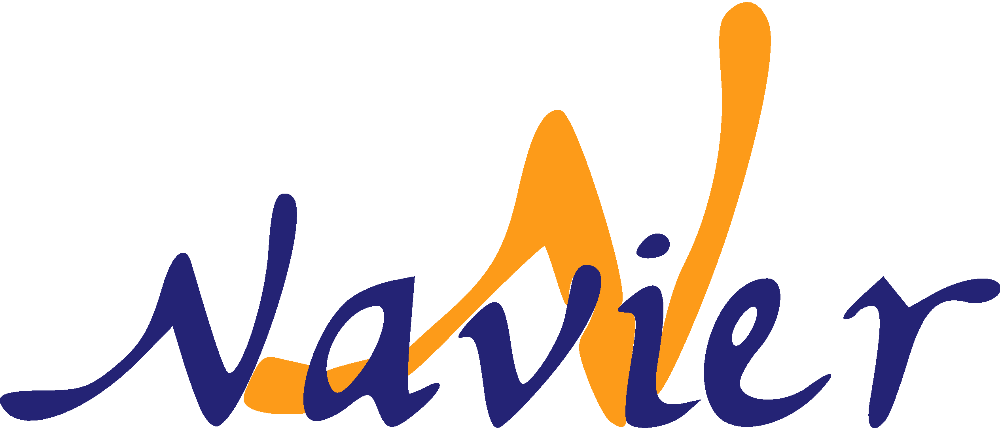

=========================
Introduction
=========================

Welcome to these **Numerical Tours of Computational Mechanics with FEniCS**.

------------------------
What is it about ?
------------------------

These numerical tours will introduce you to a wide variety of topics in
computational continuum and structural mechanics using the finite element software FEniCS.
Many covered topics can be considered as standard and will help the reader in
getting started with FEniCS using solid mechanics examples.

Other topics will also be more exploratory and will reflect currently investigated research topics,
illustrating the versatility of FEniCS.

The full set of demos can be obtained from the *COmputational MEchanics Toolbox* (COMET) available at
https://gitlab.enpc.fr/jeremy.bleyer/comet-fenics.

A new set of demos illustrating how to couple FEniCS with the `MFront` code generator have been added.
They are based on the :code:`mgis.fenics` module of the `MFrontGenericInterfaceSupport (MGIS) project <https://thelfer.github.io/mgis/web/index.html>`_. 
A general introduction of the package is `available here <https://thelfer.github.io/mgis/web/mgis_fenics.html>`_ and the demos source
files can be found `here <https://gitlab.enpc.fr/navier-fenics/mgis-fenics-demos>`_.
This project has been realized in collaboration with Thomas Helfer (CEA, thomas.helfer@cea.fr).

--------------------
Citing and license
--------------------

If you find these demos useful for your research work, please consider citing them using the following
Zenodo DOI :

|DOI|

.. image:: https://zenodo.org/badge/DOI/10.5281/zenodo.1287832.svg
   :target: https://doi.org/10.5281/zenodo.1287832

.. code-block:: none

	@article{bleyer2018numericaltours,
	title={Numerical Tours of Computational Mechanics with {FE}ni{CS}},
	DOI={10.5281/zenodo.1287832},
	publisher={Zenodo},
	author={Jeremy Bleyer},
	year={2018}}

All this work is licensed under the `Creative Commons Attribution-ShareAlike 4.0 International License <http://creativecommons.org/licenses/by-sa/4.0/>`_ |license|.

.. |license| image:: https://i.creativecommons.org/l/by-sa/4.0/88x31.png

The MGIS project can be cited through the following paper 

|DOI|

.. |DOI| image:: https://joss.theoj.org/papers/10.21105/joss.02003/status.svg
   :target: https://doi.org/10.21105/joss.02003

.. code-block:: none

 @article{Helfer2020,
  doi = {10.21105/joss.02003},
  url = {https://doi.org/10.21105/joss.02003},
  year = {2020},
  publisher = {The Open Journal},
  volume = {5},
  number = {48},
  pages = {2003},
  author = {Thomas Helfer and Jeremy Bleyer and Tero Frondelius and 
            Ivan Yashchuk and Thomas Nagel and Dmitri Naumov},
  title = {The `MFrontGenericInterfaceSupport` project},
  journal = {Journal of Open Source Software}
 }

-----------------------
How do I get started ?
-----------------------

You can find instructions on how to install FEniCS on the FEniCS project website
http://fenicsproject.org. In the following numerical tours, we will use the
Python interface for the different FEniCS scripts. These demos are compatible with
FEniCS 2018.1.0 but many should work with older versions after minor changes.

FEniCS is also distributed along with an important number of documented or
undocumented examples, some of them will be revisited in these tours but do not
hesitate over looking at other interesting examples.

In the following, we will assume that readers possess basic knowledge of FEniCS commands.
In particular, we advise you to go first through the documentation and tutorials https://fenicsproject.org/tutorial/
if this is not the case.

----------------------
About the author
----------------------

`Jeremy Bleyer <https://sites.google.com/site/bleyerjeremy/>`_ is a researcher
in Solid and Structural Mechanics at `Laboratoire Navier <http://navier.enpc.fr>`_,
a joint research unit of `Ecole Nationale des Ponts et Chaussées <http://www.enpc.fr>`_,
`IFSTTAR <http://www.ifsttar.fr>`_ and `CNRS <http://www.cnrs.fr>`_ (UMR 8205).

email: jeremy.bleyer@enpc.fr

.. image:: _static/logo_tutelles.png
   :scale: 20 %
   :align: right

